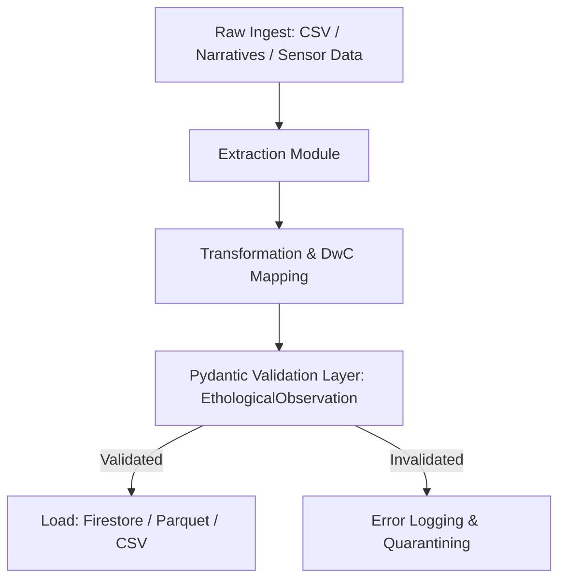

# EthoPipe: ETL Pipeline for Applied Canine Ethology

[](https://opensource.org/licenses/MIT)
[](https://www.python.org/)

**EthoPipe** is a Python-based Extract, Transform, Load (ETL) pipeline engineered to resolve the data fragmentation bottleneck in applied canine ethology and behavioral clinical studies. By formalizing strict, veterinary-validated boundary constraints and mapping categorical motor patterns to international data sharing standards, EthoPipe provides a reliable engineering bridge between raw veterinary narratives and standardized, open-science databases.

---

## 🔬 Core Capabilities

*   **Strict Operational Boundaries:** Leveraging Pydantic v2 for deterministic runtime type checks. Rejects implicit casting and enforces rigorous physiological limits (e.g., heart rates bounded strictly to $30\text{–}250\text{ BPM}$, body temperature to $35.0\text{–}40.0^\circ\text{C}$).
*   **Darwin Core (DwC) Standardization:** Automatically maps validated outputs to DwC terms (`dwc:individualID`, `dwc:eventDate`, `dwc:locality`, `dwc:measurementType`, `dwc:measurementValue`, `dwc:measurementUnit`, and `dwc:basisOfRecord`), ensuring high interoperability with global biodiversity networks.
*   **Behavioral Controlled Vocabulary:** Classifies motor patterns strictly against standardized ethograms, supporting categorized states such as stress displacement markers, appease behaviors, and high-reactivity postures (e.g., `licking_of_lips`, `looking_away`, `play_bow`, `lunges`, `cowers`).
*   **Dual Ingestion Modes:** Engineered to process both manual ethogram logs (`HumanObservation`) and high-frequency physiological telemetry (`MachineObservation`).

---

## 🛠️ Architecture



---

## 🚀 Getting Started

### Prerequisites

*   Python 3.10 or higher
*   Virtual environment manager (e.g., `venv` or `uv`)

### Installation

1. Clone the repository:
   ```bash
   git clone https://github.com/sothiss/ethopipe.git
   cd ethopipe
   ```

2. Initialize a virtual environment and install dependencies:
   ```bash
   python -m venv .venv
   source .venv/bin/activate  # On Windows: .venv\Scripts\activate
   pip install --upgrade pip
   pip install -e .
   ```

---

## 💻 Technical Usage Example

```python
from datetime import datetime
from ethopipe.models import EthologicalObservation

# A human-observed reactive event with physiological telemetry
raw_payload = {
    "subject_id": "SUB-DOG-828",
    "timestamp": datetime.now(),
    "location": "Canine Behavioral Assessment Facility, Room B",
    "behavior_type": "lunges",
    "behavior_value": 3,  # Frequency of lunges
    "severity_score": 4,  # Standardized high-reactivity score
    "heart_rate": 185,    # Elevated heart rate (BPM)
    "heart_rate_unit": "BPM",
    "observation_method": "HumanObservation",
    "narrative": "Subject displayed high-reactivity when visual barrier was removed; lunged 3 times at stimulus dog."
}

# Enforce deterministic schema validation
observation = EthologicalObservation(**raw_payload)
print(f"Validated DwC Individual ID: {observation.subject_id}")
print(f"Observed Behavioral Type: {observation.behavior_type}")
```

---

## 🧪 Testing

To run the JOSS-compliant test suites (ensuring strict boundary checks, regression testing, and parse verification):

```bash
pytest tests/
```

---

## 📄 License

EthoPipe is distributed under the **MIT License**. For details, please consult the [LICENSE](LICENSE) file.

---

## 🤝 Contribution Guidelines

We welcome contributions to standardize behavioral vocabularies further. When proposing changes:
1. Ensure all new behavioral codings correspond to validated ethogram dictionaries.
2. Maintain $100\%$ type coverage and write associated `pytest` suites.
3. Submit a pull request mapping any novel attributes to appropriate Darwin Core properties.
